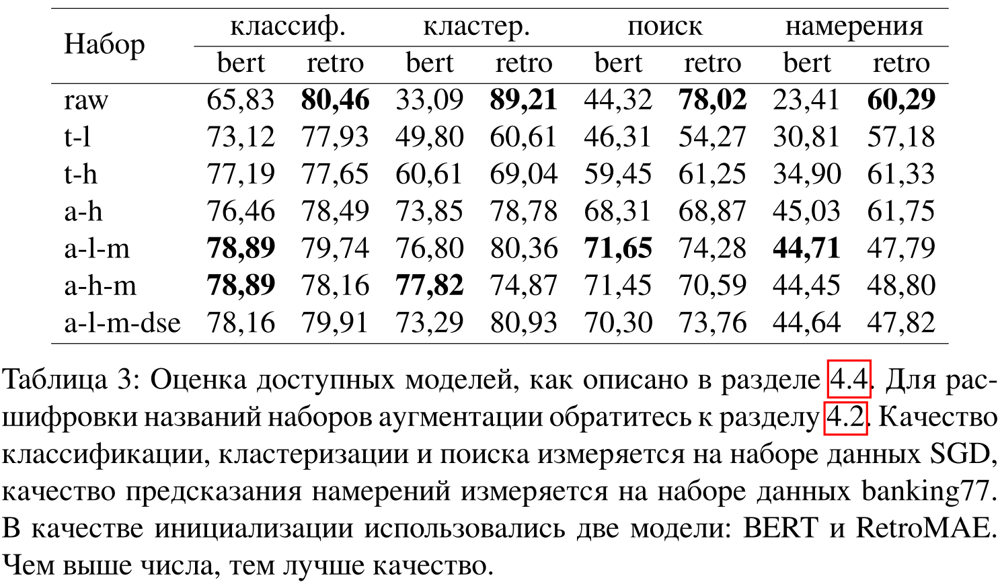
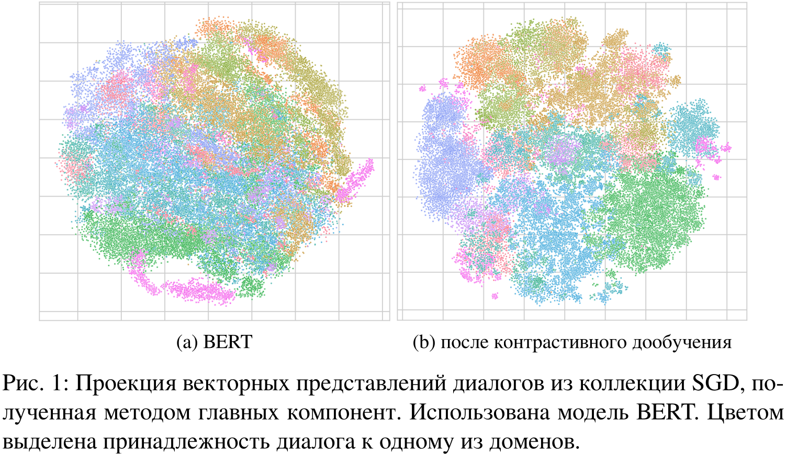
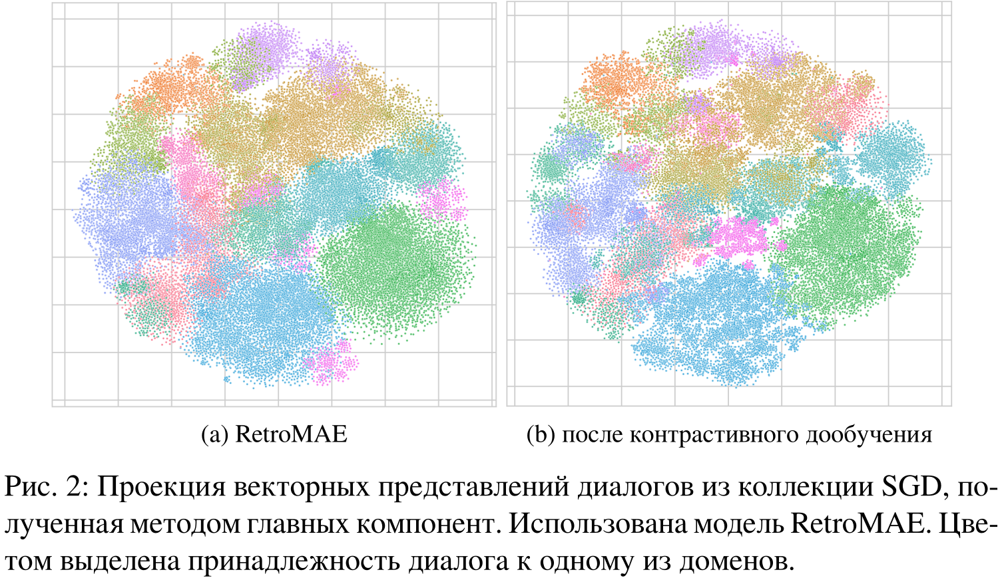
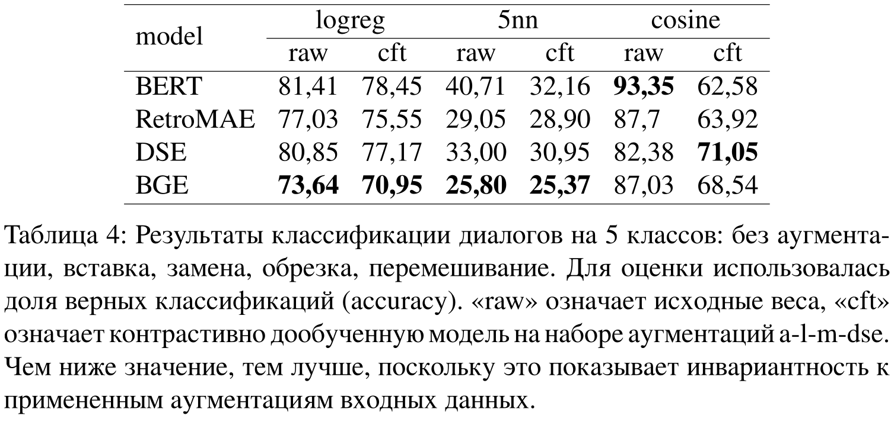
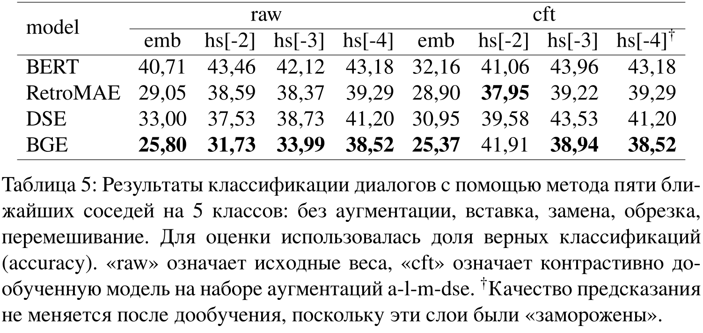

# Contrastive Learning with Augmentations for Training Dialogue Embeddings

Vector representations derived from pre-trained language models have proven extremely effective for a variety of text-based tasks such as text pair classification, semantic similarity, and retrieval. Corresponding models are typically trained on large amounts of clean and diverse data using a contrastive loss. Unfortunately, there are no such datasets for the field of conversational systems. This paper describes the process of creating a synthetic set of dialogues using specially developed augmentations. A comparison was made of different augmentations in terms of the quality of knowledge transfer to tasks associated with dialogue systems.

## Dialogue Augmentations

Implemented [here](https://github.com/voorhs/dialogue-augmentation/tree/main/mylib/augmentations). You can see [demo](https://github.com/voorhs/dialogue-augmentation/tree/main/demo).

The developed augmentations reflect some invariants inherent in conversational data. Therefore, it is fair to assume that a model adapted for working with dialogue should not produce significantly different vector representations of objects before and after augmentations. This provides some justification for the use of contrastive learning on dialogue augmentations as a procedure for adapting a language model to the domain of dialogue data.

**Inserting tokens**. One simple but effective way to augment text is to lengthen it by inserting additional tokens. For this purpose, we added a special token \[MASK\] to random places in the dialogues and used a RoBERTa. The insertion is rejected if the token proposed by the model is only a subword, or if the prediction probability is below a manually selected threshold. To account for the context of the dialogue during token insertion, several consecutive dialogue utterances are fed into the input of the mask-filling model, as a compromise between feeding individual utterances and feeding the entire dialogue.

**Replacing tokens**. This method is identical to the previous one, except that instead of adding a mask token, we replace some of the tokens.

**Reverse translation**. Translation from an original language into another language and then back into the original language. Neural machine translation models were used for this purpose (`Helsinki-NLP/opus-mt-en-ru`).

**Shuffling utterances**. Previous augmentation methods modify dialogue within a single utterance and are applicable to arbitrary text data. Changing the order of dialogue utterances is a stronger augmentation. To implement this idea, we propose use a model that measures the similarity between utterances in a dialogue. Using these similarities, it is possible to group utterances within each conversation using agglomerative clustering. Experiments have shown that these groups represent separate independent stages of dialogue that can be mixed with each other.

**Dialogue pruning**. Individual groups of dialogue utterances may be discarded, resulting in shortened dialogue with fewer utterances.

## Contrastive Fine-tuning

A random augmentation is chosen on the fly idependently for each dialogue in a training batch. Then cotrastive loss is calculated
```math
\mathcal{L}=-\log\frac{\exp(\cos(x,y))}{\sum_z\exp(\cos(x,z))},
```
where x and y are the dialogue and its augmentation and "z"s are the other dialogues in a batch.

## Experiments

All datasets are taken from the DialogStudio collection comprising about 433K dialogues. Batch size 128 on two A100 40GB, AdamW optimizer with weight_decay 1e-2 and fixed learning step 3e-6. We froze all layers of the transformer except the last three.

### Optimizing Augmentation Set



Contrastive fine-tuning with augmentations provides an increase in quality for the original BERT weights. The smallest increase comes from a set of simplest augmentations at the token level: replacement and insertion. The best gains were achieved by the a-l-m and a-h-m augmentation sets. The a-l-m-dse set has the least complexity to implement and does not require training an auxiliary model. At the same time, for BERT, the resulting metrics have a large gap with the metrics of trivial augmentations, and a small gap with the metrics of heavy a-h-m augmentations. Therefore, in the following experiments, a set of augmentations a-l-m-dse is used as a compromise between the quality
versatility and complexity of implementation.

Contrastive fine-tuning with augmentations does not provide an increase in quality for initialization from RetroMAE weights. For all evaluation scenarios, the metrics drop.

### Scatter of Embeddings





### Invariance Analysis



The ability of models to capture dialogue invariants is investigated. To do this, for each vectorization model, several simpler models were trained for the classification task, in which the label is what augmentation was performed on the dialogue, including the absence of augmentations. The results are presented in Table 4. After additional training with various initializations, it is possible to predict the type of augmentation with less accuracy, which can be due to two non-mutually exclusive reasons: 1) the model acquires invariance to augmentations, which indicates its adaptation to dialogue data, 2) the general ability of this model to understand the language has deteriorated. However, the second reason is inconsistent with the fact that stronger encoders like DSE and BGE have even lower quality of augmentation prediction, especially with metric methods.

Additionally, it is worth noting that the stronger the encoder in general for texts, the less accurate it is at predicting augmentation.

### Hidden States Analysis



Additionally, we examined the quality of augmentation prediction using vector representation taken from earlier layers. The results are presented in Table 5. It turned out that the quality of prediction drops sharply in the last layer, especially after contrastive fine-tuning with augmentations. In other words, the last layers try to obtain representations that are more invariant to augmentations and, as a result, adapt the model to the data.

## Conclusion

A study of neural network vector representations for task-oriented dialogues was carried out. A procedure for contrastive learning with augmentations is proposed. The effectiveness of this procedure has been demonstrated for BERT-like models in tasks such as dialogue classification, dialogue clustering, dialogue retrieval, and intent prediction. An ablation study was conducted showing the contribution of different augmentations to the quality of the final model. Together with additional research on encoder invariance to augmentations, the following conclusions can be drawn:
- general purpose encoders available today are quite well adapted to conversational data;
- contrastive learning with augmentations is a fairly cheap procedure for obtaining embeddings adapted to a given data domain.

Further research may involve more fine-tuning of the training procedure in terms of selecting hyperparameters, since this work was not able to surpass the quality of existing models.
